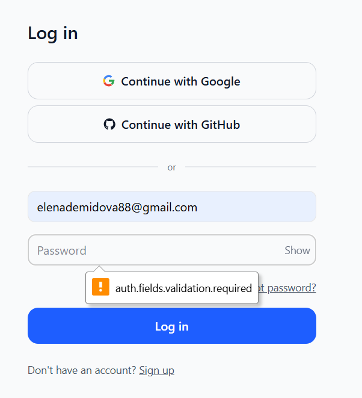
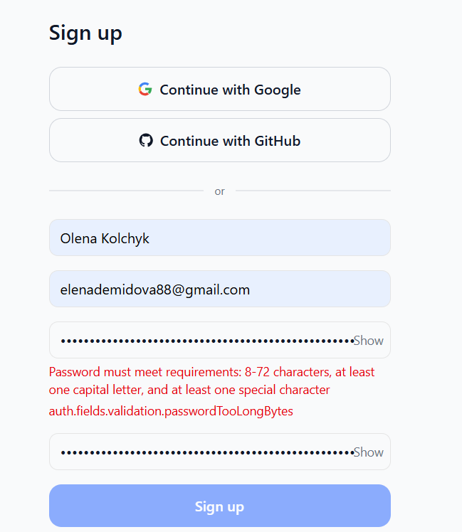
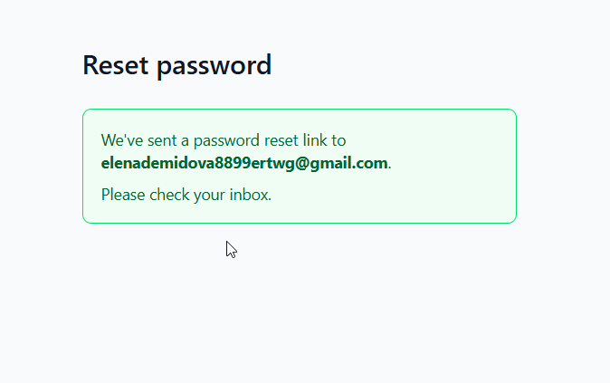
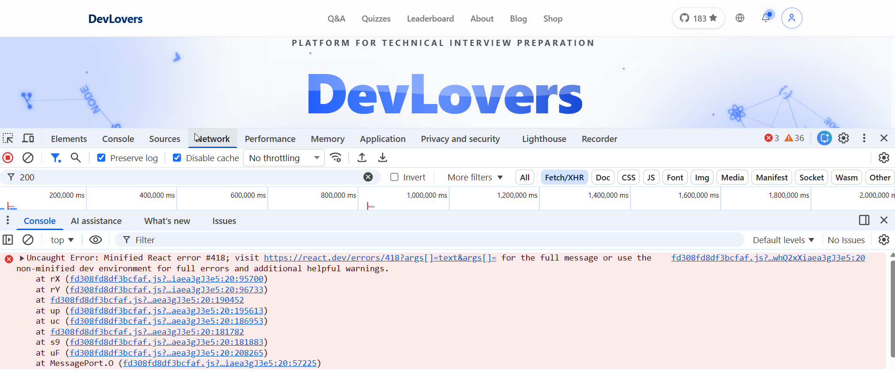

# 🔎 DevLovers QA Testing

QA testing documentation, checklists, and bug reports for the DevLovers platform.

## Overview
This repository contains:

- ✅**Checklists** — step-by-step QA checklists for login, leaderboard, About, Blog, and other sections.
- 🐞**Bug Reports** — short descriptions of found bugs with screenshots; full details in Google Sheets.
- 📸**Screenshots** — visual proof of bugs or UI issues.

Testing covers:

- Manual testing of web functionality
- Regression testing
- Functional, UX, and network/console checks

---

## Beta Testing Documentation
All QA checklists and bug reports are stored in a separate file:

- [DevLovers Beta Testing Report](https://docs.google.com/spreadsheets/d/1ErFWru9Y4mnAHZ-r5-jo5OKCgD_70_IND56m2_5yU6k/edit?usp=sharing)

## Sample Bugs
Short description of selected bugs with screenshots:

- **Login (1.3)** — Required fields validation shows raw key  
  

- **Registration (1.9)** — Password rules show raw validation key  
  
  
- **Forgot Password (1.14)** — Unregistered email shows success message  
  

- **Homepage / Network (7.2)** — React error #418 in JS requests  
  

> More bugs and checklists are available in the Google Sheets linked above.

---

## Testing Tools

🔧 Chrome DevTools  
📊 Google Sheets  
🐙 GitHub

## Repository Structure
```text
DevLovers-QA/
├── docs/
│   └── devlovers-beta-testing-report.md  # Main QA report with links to checklists and bug reports
├── screenshots/
│   ├── login_form/
│   │   └── login_raw_key.png
│   ├── registration/
│   │   └── password_raw_key.png
│   ├── forgot_password/
│   │   └── unregistered_email.png
│   └── network/
│       └── react_error_418.png  
